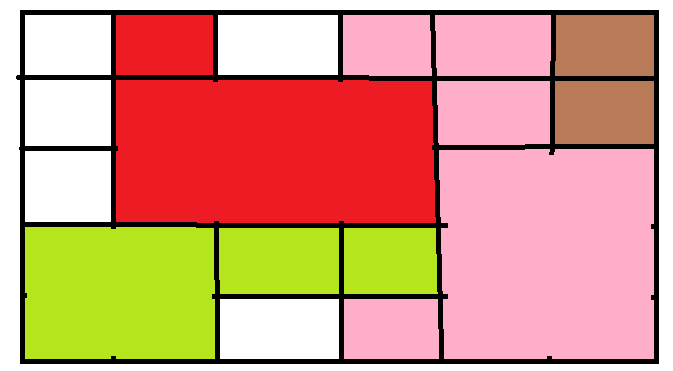

大喵教育前端培训
================

## 阶段性测试 2018.05.11

### 大喵教育版权所有 | 出题人：谢然


01. 列出至少 7 个常用 Linux 命令及其基本使用方法
  * cd 切换目录 ../上级目录  ./当前目录
  * ls 查看目录  -a查看所有目录 -l显示权限、大小等属性 -h已更能理解的方式显示
  * mkdir 新建文件夹
  * rmdir 删除空文件夹
  * touch 新建文件
  * cd 旧文件 新文件 复制文件
  * ping 192.168.31.1  pingip地址

02. 什么是 html 实体？常见 html 实体有哪些？
  * html规则，已&unicode;形式出现，可以再html里显示<, >等敏感符号
  * `&nbsp;` 不会被合并的空格
  * `&lt;` <
  * `&gt;` >
  * `&amp;` &
  * `&quot;` "
  * `&apos;` '
  * `&lpar;` &rpar; ()
  * `&lsqb;` &rsqbl []
  * `&lcub;` &rcub; {}
  * `&copy;` ©
  * `&reg;` ®
  * `&equals` =

03. 计算机为什么使用二进制？
  * 使用5v和0v，容错性高

04. 什么是 Unicode？如何表示，有什么作用？最通用的 Unicode 实现是？
  * 2个字节表示一个字符，包含全世界所有字符，使得不同地区的文件可以相互打开
  * html实体

05. 什么是 GUI，什么是 CLI，什么是接口/界面？现实生活中有哪些例子？
  * GUI Graphics User Interface 图形用户接口
  * CLI Command Line Interface 命令行接口
  * 与用户交互的界面，如取款机窗口

06. 在什么情况下 html 标签可以不需要闭合？
  * 自闭合标签，如img，input
  * 下一个元素不可以是当前元素子元素

07. 在一些情况下某些非自闭合标签的结束标签可以省略的原因是什么？
  * 下一个标签不能为当前标签的子标签

08. 什么是费茨定律？它有哪些应用？
  * 移动到目标位置与距离和目标大小呈正相关
  * 网页按钮做的大一些

09. 为什么英文很重要？
  * 技术技术文档，博客，命令，报错，软件界面是英文

10. 将二进制 `10010` 数转换为十进制数
  * 16+2=18

11. 将十六进制数 `ABCDEF` 转换为十进制数
  * 15*16^0 + 14*16^1 + 13*16^2 
   12*16^3 + 11*16^4 + 10*16^5 = 11259375

12. 将十进制数 `435` 分别转换成二进制数和十六进制数
  * 435-256=179 179-128=51 51-32=19 19-16=3
  * 0001 1011 0011
  * 0x1B3

13. 请说出你对命令行程序的理解，以及其与 GUI 程序的区别
  * 相同范围内，CLI能够显示更多有效信息，稳定性更高，报错明显，熟悉后，比GUI操作更快，
  * 区别是显示形式不一样

14. 列出 HTML 中常见的全局属性
  * id class style title data-* hidden 

15. 什么是操作系统的路径（Path）？它的作用及应用场景是？
  * 环境变量，系统会在Path里寻找可执行文件
  * 往默认路径添加一个文件夹，把快捷方式放到里面，在运行里输入快捷方式名称就
    可以打开快捷方式

16. 什么是文本文件？什么是二进制文件？它们最明显的区别是？
  * 文本文件是被编码的文件，二进制文件是二进制码
  * 文本文件可读，二进制文件不可读

17. 为什么说 html 与数学公式有诸多相似之处？
  * html树状结构，集合概念，数列概念

18. 几种常见图片格式有什么区别和特点？
  * jpg 有损压缩，适合保存照片
  * png 无损压缩，适合保存截图，图标，有透明通道（0-255）
  * gif 颜色256内无损压缩，可以动图，透明通道（0，1）
  * psd ps才能打开，保存了操作记录，图层等，文件比较大
  * bmp 无压缩，文件比较大
  * webp 有损压缩 全面胜过jpg 适合移动端

19. `data-*` 属性一般是用来干嘛？
  * 自定义属性

20. 什么是 MIME Type？
  * 多用途internet邮件扩展类型
  * input类型为file时，用来匹配文件
  * 语法：type/subtype
  * image/png 表示匹配png格式图片
  * video/* 表示匹配所有格式视频

21. 哪些标签可以使用 target 属性？哪些标签可以使用 href 属性？
  * target: a area form base
  * href: a area base link

22. 把如下以十进制表示的字节序列按utf8的格式转码为Unicode编码序列。然后查出每个编码对应的具体符号：
    
    230, 152, 159, 230, 156, 159, 49
  * 11100110 10011000 10011111 > 0110 0110 0001 1111 > 星
  11100110 10011100 10011111 > 0110 0111 0001 1111 > 期
  00110001 > 011 0001 > 1
23. group 类型的标签有哪些？
  * header main aside footer hgroup 

24. 什么是 SEO？
  * 搜索引擎优化 Serch Engine Optimism
  * 使得页面在搜索引擎尽量靠前

25. 分别列出每种常见浏览器的内核名称（自己查）。
  * IE Trident
  * Safari Webkit
  * Chrome Chromium > Blink(2013年)
  * Opera Presto > Blink(2013年)
  * Firefox Gecko

26. 列表类标签有哪些？分别如何使用？需要注意些什么？
  * ```
    <table>
      <caption></caption>//表名
      <col style="">//第一列样式
      <thead>//列头的行
        <tr>
          <th></th>//表头单元格
          <th></th>
        </tr>
      </thead>
      <tbody>
        <tr>
          <td></td>//内容
          <td></td>
        </tr>
       </tbody>
      </table>
```
27. 为什么查文档一般不推荐 W3School？
  * 过时，不准，错误多，有广告

28. 为什么不同类型的标签的 fallback 内容要以不同的形式提供？
  * 内容在2个标签内显示，fallback要放在外面如`<noscript>`
  * 内容为替换元素，要放在标签内，如``
      或放在2个标签内，如`<iframe>`

29. 分别写出在 head 中设定页面编码，设定 icon，引入样式表的标签
  * `<meta charset="utf-8">`
  * `<link rel="icon" href="">`
  * `<link rel="stylesheet" href="">`

30. 什么叫做可访问性，html 中为此做了什么工作？
  * accessibility 使得所有人都能无障碍访问网页
  * 明确html标签语意
  * aria-* 与 role 属性

31. 请确认以下标签分别属性什么类别（Content Category）？
    
    p, meta, h1, fieldset, option, input, area

  * `<p>` Flow content
  * `<meta>` Main content, Flow content(当itemprop属性存在)
      Phrasing content(当itemprop属性存在)
  * `<h1>` Flow content, Heading content
  * `<fieleset>`  Flow content, Form-associated content
  * `<option>` Flow content, Phrasong content, Interactive content
  * `<input>` Flow content, Phrasing content, Interactive content,
      Form-associated content
  * `<area>` Flow content(当作为<map>子节点)， Phrasing content
      (当作为<map>子元素)
  
32. 写出以下几个符号的 ascii 码：`a，A，0，CR，LF，空格，NBSP`。
  * 0x61 0x41 0x30 0x0D 0x0A 0x20 木有

33. 写出如下结构中div元素的所有后代/祖先/子/父/兄弟元素
    ```html
    <section> 祖先
      <h1>
        <span></span>
      </h1>
      <main> 父
        <h2></h2> 兄弟
        <div>
          <ul> 子
            <li><a href=""></a></li> 后代
          </ul>
        </div>
        <aside>兄弟
          <h3></h3>
        </aside>
      </main>
    </section>
    ```

34. 用什么方法扩大一个 checkbox 的可点击区域？
  * 增加padding或border
  * `<input type="checkbox" id="aa">`
    `<label for="aa">aaa</label>`
35. 什么是 BOM 头？
  * 记事本会在开头添加一段隐藏的字符串，不能用记事本写代码

36. 常见的替换元素有哪些？它们与非替换元素最大的区别什么？
  * img input ifream
  * 标签只是占位符，fallback写在标签属性里或两个标签中间

37. 让 CSS 在 HTML 页面上生效有哪几种方法，分别写出来。
  * 写在`<style>`标签内
  * 在标签内添加属性`style=""`
  * `<link>`引入
  * @import引入

38. 如何让页面打印时应用不同的效果？
  * `<link rel="stylesheet" href="" media="print">`

39. 假设 index.html 的路径为 http://user.coding.me/task/index.html ，如下引用的a.css和b.css路径分别为？
    ```html
    <!-- index.html的内容 -->
    <style>
        @import "../a.css";
    </style>
    ```
    ```css
    /* a.css的内容 */
    @import "b.css";
    ```
  * http://user.coding.me/a.css
  * http://uesr.coding.me/b.css

40. 将如下 markdown 转换成 html
    ```html
    <html>
      <head>
        <title>四季</title>
      </head>
      <body>
        <h1>四季变换</h1>

        <p>一年有四季，<br>四季有其对应的节气</p>
        <ul>
          <li>
          春
            <ul>
              <li>立春</li>
              <li>惊蛰</li>
              <li>元宵</li>
            </ul>
          </li>
          <li>
          夏
            <ul>
              <li><strong>小米</strong>发布会</li>
              <li>华为发布会</li>
            </ul>
          </li>
          <li>
          秋
            <ul>
              <li>开学了</li>
              <li>军训了</li>
            </ul>
          </li>
          <li>
          冬
            <ul>
              <li>
              下雪了
                <ul>
                  <li>打雪仗了</li>
                </ul>
              </li>
              <li>来暖气了</li>
              <li>开空调了</li>
            </ul>
          </li>
        </ul>

        <blockquote>知识就是力量，法国就是培根。</blockquote>

        <a href="http://baike.baidu.com/item/%E6%98%A5/6983693">春</a><br>
        
      </body>
    </html>
    ```

    ```md

    #四季变换

    ##一年有四季，四季有其对应的节气

    * 春
        - 立春
        - 惊蛰
        - 元宵
    * 夏
        - **小米**发布会
        - 华为发布会
    * 秋
        - 开学了
        - 军训了
    * 冬
        - 下雪了
            + 打雪仗了
        - 来暖气了
        - 开空调了

    > 知识就是力量，法国就是培根。

    [春](http://baike.baidu.com/item/%E6%98%A5/6983693)
    
    ```

41. 什么是模拟信号？什么是数字信号？它们的区别是？
  * 模拟信号直接传输信息，衰减小，传输距离远，可能会失真
  * 数字信号传输二进制数，衰减大，传输距离近

42. 如下表单提交后将跳转到什么地址
    ```html
    <form action="https://www.baidu.com/s" target="_blank">
      <input type="text" value="bb" name="a">
      <input type="checkbox" name="b" id="b" value="123" checked>
      <input type="checkbox" name="b" id="b" value="456" checked>
      <input type="checkbox" name="b" id="b" value="789">
      <input type="radio" name="c" id="c" value="a2">
      <input type="radio" name="c" id="c" value="a5" checked>
      <input type="radio" name="c" id="c" value="a4">
      <select name="select">
        <option value="01">0001</option>
        <option value="02">0002</option>
        <option value="03" selected>0003</option>
        <option value="04">0004</option>
        <option value="05">0005</option>
      </select>
      <button>提交</button>
    </form>
    ```
  * https://www.baidu.com/s?a=bb&b=123&b=456&c=a5&select=0003

43. 列出 input 的 type 有哪些值，以及为各个值时分别需要怎么使用。
  * button：无缺省行为按钮
  * checkbox：复选框，必须使用value属性定义此控件被提交时的值，使用checked属性指示控件是否被选择，也可用indeterminate指示复选框在一种不确定状态
  * color：颜色
  * date：日期
  * datetime：基于时区的
  * datetime-local：不包含时区
  * email：可使用:valid和:invalid伪类
  * file：使用accept属性选择文件的类型
  * hidden：不显示在页面，值会被提交
  * image:必须使用src属性定义图片来源及alt属性定义代替文本
  * month：不带时区
  * number：浮点数
  * password：被遮盖的单行文本字段，maxlength指定输入值最大长度
  * radio：单选按钮，value定义被提交的值同一单选按钮组所有name需相同
  * reset：重置表单
  * search：输入搜索字符串的单行文本字段，换行会被从输入的值中自动移除
  * submint：提交表单
  * tel：电话
  * text：单行文本
  * time：不含时区
  * url：url
  * week：不包含时区

44. 想要让一个文本输入框在页面打开后自动获得光标要怎么办？
  * 增加autofocus属性

45. 如何在文本框里放置提示性文字？
  * 属性placeholder=""

46. option 标签的主体内容太长影响用户体验，你会如何解决？
  * select里设置style="width:100px"

47. 想要在 textarea 标签中默认显示一段 html 代码最安全的做法是什么？
  * html实体

48. 如何禁用一组输入框？
  * disabled，会继承

49. 如下表格渲染出来后是什么效果？不要直接将代码贴入jsbin中看效果
    ```html
    <table border=1>
      <caption>美国队长</caption>
      <col>
      <col bgcolor=red>
      <col>
      <colgroup bgcolor=pink>
        <col>
        <col>
        <col bgcolor=brown>
      </colgroup>
      <thead>
        <tr>
          <th>01</th>
          <th>02</th>
          <th>03</th>
          <th>04</th>
          <th>05</th>
          <th>06</th>
        </tr>
      </thead>
      <tbody>
        <tr>
          <td>abc</td>
          <td colspan=3 rowspan=2>abc</td>
          <td>abc</td>
          <td>abc</td>
        </tr>
        <tr>
          <td>abc</td>
          <td colspan=2 rowspan=3>abc</td>
        </tr>
        <tr bgcolor=lightgreen>
          <td colspan=2 rowspan=2>abc</td>
          <td>abc</td>
          <td>abc</td>
        </tr>
        <tr>
          <td>abc</td>
          <td>abc</td>
        </tr>
      </tbody>
    </table>
    ```
  * 

50. HTML 的 `aria-*` 与 `role` 属性的作用是？
  * 为了增强可访问性 

51. 写出如下标签或属性值的英文全称

    标签：html,div,p,a,em,tr,th,td,col,ul,ol,li,dl,dt,dd,pre,nav

    属性：coord,rect,poly,href,src

  * html: hyper text markup language/root element
  * div: the content division element
  * p: the paragraph element
  * a: the anchor element
  * em: the emphasis element
  * tr: the table row element
  * th: the table head element
  * td: the table data cell element
  * col: the column element
  * ul: the unordered lise element
  * ol: the ordered list element
  * li: the list element
  * dl: the description list element
  * dt: the description term element
  * dd: the description details element
  * pre: the preformatted text element
  * nav: the navigation section element
  * coord: coordinate
  * rect: rectangle
  * poly: polygon
  * href: hypertext reference
  * src: source

52. 中英互翻
    
    geek，nerd，hacker，edge，bleeding/cutting edge 前沿/尖端/可能存在风险的技术，HTML 实体，coordinate，polygon，bit，byte，alternative，属性，obsolate，二进制，十进制，十六进制，octal，deprecate，loop，行，列，horizontal，语义化，可访问性

  * geek 极客
  * nerd 书呆子
  * hacker 黑客
  * edge 刀锋
  * bleeding/cutting edge 尖端
  * 前沿/尖端/可能存在风险的技术 bleeding/cutting edge technology
  * HTML hyper text marked language
  * 实体 void
  * coordinate 坐标
  * polygon 多边形
  * bit 位
  * byte 字节
  * alternative 替换物
  * 属性 property attributes
  * obsolate 过时的 
  * 二进制 binary
  * 十进制 decimal
  * 十六进制 hexadecimal
  * octal 八进制
  * deprecate 停止
  * loop 循环
  * 行 row
  * 列 col
  * horizontal 横的
  * 语义化 semantization
  * 可访问性 accessibility